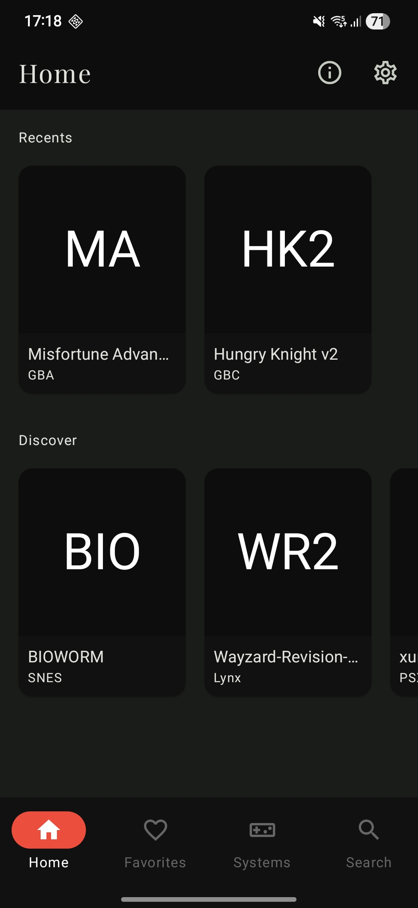
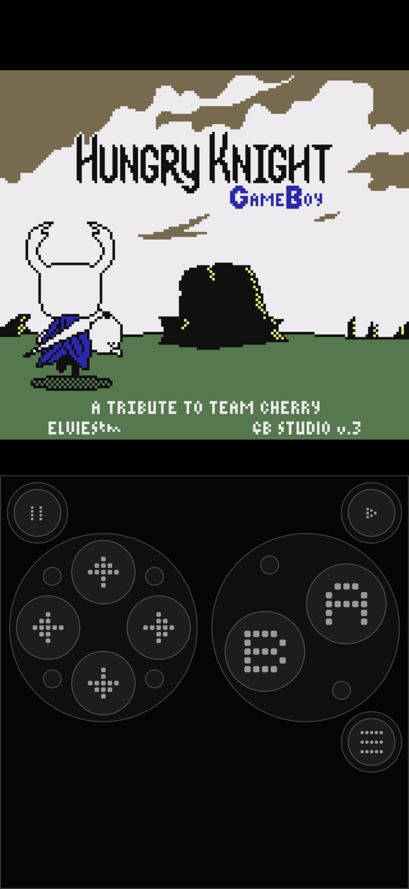
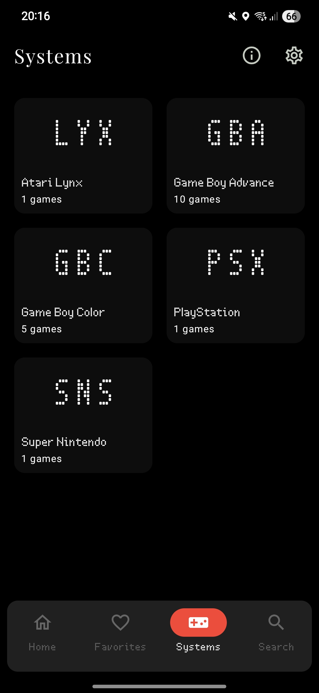

# N-Lemuroid

## Description

N-Lemuroid is a specialized fork of the Lemuroid project, redesigned with a Nothing OS aesthetic. Lemuroid is an open-source emulation project for Android based on Libretro. This fork emphasizes a distinct visual identity inspired by Nothing's design language, featuring a custom UI, unique typography, and optimized interactions.

### UI Refinements (N-Lemuroid):
- **Nothing OS Aesthetics**: Redesigned UI components to match the Nothing OS look and feel.
- **Ndot Font Integration**: Native support for Ndot57 typography across game titles, system names, and navigation.
- **Floating Navigation Dock**: A custom, rounded-rectangular navigation bar positioned for easy access and modern aesthetics.
- **Refined Selection Indicators**: Sleek, focused highlights for a clean and intuitive user experience.
- **Monochrome Cartridge Overlay**: Game cards feature a simplified, monochrome cartridge-inspired design with white borders and system-specific pills.
- **Dot-Matrix Placeholders**: Loading states and missing covers feature a custom dot-matrix grid and Ndot initials.
- **Interactive Boot Animation**: A tactile "cartridge insertion" animation that triggers reactively as the game engine loads.

It originated from a rib of [Retrograde](https://github.com/retrograde/retrograde-android), but graduated to a standalone project integrating [LibretroDroid](https://github.com/Swordfish90/LibretroDroid).

### Visuals
|Screen 1|Screen 2|Screen 3|Boot Animation|
|---|---|---|---|
||||[View Video](screenshots/screen1.mp4)|

### Supported Systems:
- Atari 2600 (A26) ([stella](https://docs.libretro.com/library/stella/))
- Atari 7800 (A78) ([prosystem](https://docs.libretro.com/library/prosystem/))
- Atari Lynx (Lynx) ([handy](https://docs.libretro.com/library/handy/))
- Nintendo (NES) ([fceumm](https://docs.libretro.com/library/fceumm/))
- Super Nintendo (SNES) ([snes9x](https://docs.libretro.com/library/snes9x/))
- Game Boy (GB) ([gambatte](https://docs.libretro.com/library/gambatte/))
- Game Boy Color (GBC) ([gambatte](https://docs.libretro.com/library/gambatte/))
- Game Boy Advance (GBA) ([mgba](https://docs.libretro.com/library/mgba/))
- Sega Genesis (aka Megadrive) ([genesis_plus_gx](https://docs.libretro.com/library/genesis_plus_gx/))
- Sega CD (aka Mega CD) ([genesis_plus_gx](https://docs.libretro.com/library/genesis_plus_gx/))
- Sega Master System (SMS) ([genesis_plus_gx](https://docs.libretro.com/library/genesis_plus_gx/))
- Sega Game Gear (GG) ([genesis_plus_gx](https://docs.libretro.com/library/genesis_plus_gx/))
- Nintendo 64 (N64) ([mupen64plus](https://docs.libretro.com/library/mupen64plus/))
- PlayStation (PSX) ([PCSX-ReARMed](https://docs.libretro.com/library/pcsx_rearmed/))
- PlayStation Portable (PSP) ([ppsspp](https://docs.libretro.com/library/ppsspp/))
- FinalBurn Neo (Arcade) ([fbneo](https://github.com/libretro/FBNeo/))
- Nintendo DS (NDS) ([desmume](https://docs.libretro.com/library/desmume/)/[MelonDS](https://docs.libretro.com/library/melonds/))
- NEC PC Engine (PCE) ([beetle_pce_fast](https://docs.libretro.com/library/beetle_pce_fast/))
- Neo Geo Pocket (NGP) ([mednafen_ngp](https://docs.libretro.com/library/beetle_neopop/))
- Neo Geo Pocket Color (NGC) ([mednafen_ngp](https://docs.libretro.com/library/beetle_neopop/))
- WonderSwan (WS) ([beetle_cygne](https://docs.libretro.com/library/beetle_cygne/))
- WonderSwan Color (WSC) ([beetle_cygne](https://docs.libretro.com/library/beetle_cygne/))
- Nintendo 3DS (3DS) ([citra](https://docs.libretro.com/library/citra/))

### Features:
- Android TV support
- Automatically save and restore game states.
- ROMs scanning and indexing
- Optimized touch controls
- Quick save/load
- Support for Zipped ROMs
- Display simulation (LCD/CRT)
- Gamepad support
- Local multiplayer
- Tilt input
- Customizable touch controls (size and position)
- Cloud save sync
- HD mode
- Import / export your save files and states, create a zipped folder with your saves in one folder, states in the other like the app provides

### Languages:
You can help translate Lemuroid in your native language by going here: https://crowdin.com/project/lemuroid
